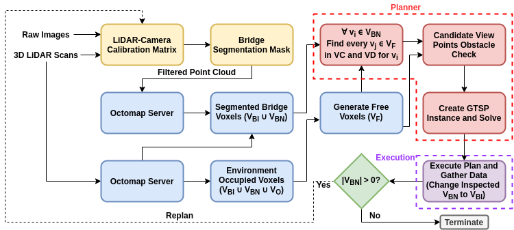

# GATSBI: An Online GTSP-Based Algorithm for Targeted Surface Bridge Inspection
This work aims to provide UAV flight in an unknown 3D environment for infrastructure inspection. This work is presented at [this arXiv location]().
<!--Add this arXiv link-->

<!-- ### Current perception version - Perception V1 -->



<!-- **Note** The red lines indicate rostopic names -->

## How to Install
Add information on how to install everything to get it to work.

#### Run Instructions
First download rosbag(simulation_v1.bag) from [here](https://drive.google.com/file/d/1f-OXbnUOXiB1iEFGs9W5oXcsnhm74dib/view?usp=sharing)

```
git checkout perception_v1
catkin_make
rosbag play <path to rosbag> -r 0.1
roslaunch pcl_filter cloud_pub.launch
```

### Package setups

1. ORB-SLAMV2 [Setup](ORB/ORB_SLAM2) | [Original Repo](https://github.com/raulmur/ORB_SLAM2)
2. LOAM-SLAM [Setup](LOAM) | [Original Repo](https://github.com/laboshinl/loam_velodyne)


| SLAM/Mapping package  | RGBD  | Stereo  | Lidar  | Fusion available |
|---                    |---    |---      |---     |---               |
| ORB-SLAMV2            | yes   | yes     | no     |   unknown        |
|  Laser Odometry and Mapping (Loam) |  No | No  | Yes  | Yes(with IMU)  |
|   |   |   |   |   |


### Datasets

| Dataset | Comments | RGBD?  | Stereo?  | Lidar? | IMU | T265 | Location |  Best Mapping| Snapshots/sample|
|---         |---    |---      |---     |---      |--   |---   |----   |--- | --- |
| wysor_1.bag | Wysor bridge pass | yes   | yes     | no |  yes  | |  Google Drive   |   LOAM  | |
| t265p3.bag | Looping data around lab  | no   | no     | yes |  yes  | yes |  Google Drive   |   LOAM (fused with IMU)| |
| labarea.bag | Data about lab's walls  | no   | no     | yes |  yes  | no |  Google Drive   |   LOAM & Open mapping| |
| iribepart1.bag  | Iribe ground floor mapping  | no  | no  | yes | yes| no | Google Drive|  LOAM| |


### Running all code
To launch an environment launch the following line of code:

`roslaunch hector_moveit_gazebo final_bridge.launch`

Add this python code in if you want to use the neural net for segmentation.
Location ~/catkin_ws/src/3D_bridge_meshes:

```
python3 image_server.py
python get_image.py
python pub_images.py
```

Location ~/catkin_ws/src/simulation_model:

`python3 run_show_results__.py`


To launch filters for LiDAR and RGB camera: (Note: had to split octomap_server_velo and octomap_server_trimmed)

```
roslaunch pcl_filter cloud_pub.launch
rosrun octomap_server octomap_server_node _resolution:=1 _frame_id:="world" _sensor_model/max_range:=40 cloud_in:=transformed_cloud_image_frame
rosrun octomap_server zFilter
```

To launch low-level controller:
Either autonomous flight can be done using

`roslaunch hector_moveit_navigation navigate.launch`

or if you want to do manual flight

```
rosservice call /enable_motors true
rosrun teleop_twist_keyboard teleop_twist_keyboard.py
```

To run GTSP solver:

`rosrun gtsp gtsp_solver`

To run visited points publisher:

`rosrun octomap_server visitedPoints_Publisher`

To run baseline for GATSBI algorithm:

```
rosrun octomap_server baseline
roslaunch hector_moveit_frontier_exploration frontier_explore.launch
```

To run GATSBI algorithm:

`rosrun octomap_server kevin`

To plot path of UAV:

`rosrun hector_trajectory_server hector_trajectory_server`
